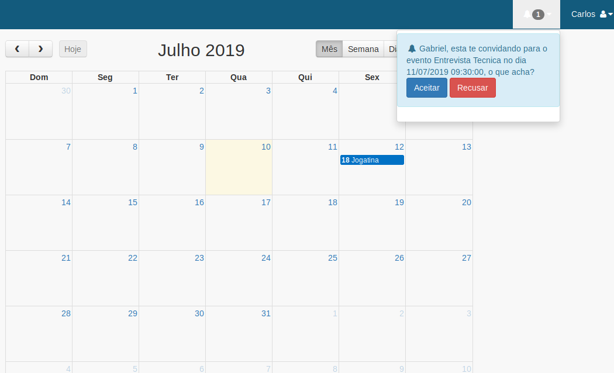

# Requisitos
## Telas
### Agendamento
**Melhorias:**
- [x] ~~*Campo 'Estilo', texto livre e obrigatório.*~~ [09-08-2024]
### Horarios Agendados
- [x] ~~*Editar agendamento.*~~ [11-08-2024]
  - [ ] Verificar exibição dos botões de exclusão e editar (Só deve ficar disponivel para quem agendou e o perfil master)
- [x] ~~*Deixar visivel para todos os usuários, apenas os dias, horários e quem agendou.*~~ [09-08-2024] **Dúvida**
- [x] ~~*Criar filtro por mês.*~~ [09-08-2024]
- [x] ~~*Excluir agendamento (Perfil master exclui qualquer agendamento).*~~ [09-08-2024]
  - [x] ~~*Observação: Criar log de exclusão.*~~ [09-08-2024]
- [x] ~~*Envio de e-mail (Cliente e Tatuador).*~~ [09-08-2024]
  Observação:
    - [x] ~~*No dia que foi agendado*~~ [09-08-2024]
    - [x] ~~*Usuário deve digitar o e-mail para enviar o e-mail para o cliente.*~~ [09-08-2024]
    - [x] ~~*Um dia antes.*~~ [10-08-2024]
- [ ] Envio de Wpp, Qual valor ?
- [ ] Criar visualização por Calendario (Exemplos no GitHub).
  - [ ] https://github.com/GabrielpBiu/calendario-de-eventos-php-fullcalendar-mysql?tab=readme-ov-file
  - [ ] https://github.com/DehDelfino/Calendario

### Criar Acesso
Sem Melhorias
### Tela de Usuarios
- [x] ~~*Visualizar lista de usuários cadastrados.*~~ [09-08-2024]
- [x] ~~*Editar/Excluir usuário.*~~ [09-08-2024]
- [x] ~~*Log de alterações no usuário.*~~ [09-08-2024]
### Graficos
- [ ] Criar relatorios do tipo pizza e barra.
### Visualizar PDFs (Autorização)
- [ ] Criar formulário de perguntas.
- [ ] Enviar email com um formulário de perguntas.
- [ ] Vincular formulário a tabela de dados, para gerar o PDF.
- [ ] Criar tela para visualizar e baixar os PDFs preenchidos após o envio do email.

### Alterações
- [ ] Reenvio de email para edição de agendamento (Data)
- [x] ~~*Pagamento via Link (Stripe)*~~ [17-12-2024]
- [ ] Pagamento via link (PagBank)
- [ ] Assinatura Digital
- [ ] PDF deve conter as Assinaturas (Cliente, Responsavel e Tatuador) 
- [ ] RG não é obrigatório
- [ ] Envio de documentos caso seja menor de idade (Responsavel e Cliente)
- [ ] Filtrar horarios agendados incial do mes atual (a partir do dia atual)
- [ ] Depois de preencher o termo, enviar uma confirmação de termo preenchido
- [ ] Mostrar somente 1 termo de cada dia para cada cliente
- [ ] Bem vindo (Ortografia)
- [ ] Incluir termo de LGPD no termo
- [ ] Incluir LGPD no site (Tabela, estrutura)
- [ ] Pagina para gerenciamento de Macas
- [ ] Criar agendamento para outros usuários (Master)
- [ ] Olhar valor Wpp
- [ ] Sincroninizar Google Calendario
- [ ] Jejum ? se a pessoa preencher o termo antes do dia
 